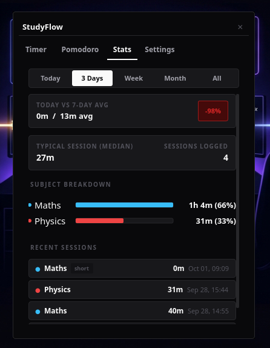
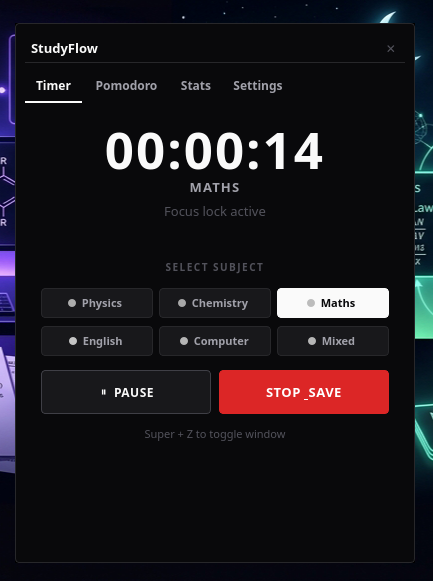
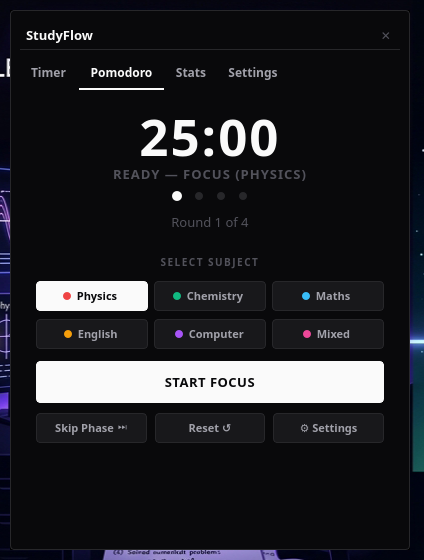
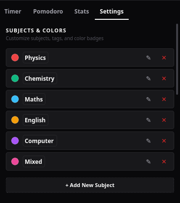

# StudyFlow ⏳
---




---
> A clean, obsidian-dark study timer and session tracker that gets out of your way.

[](https://www.python.org/)
[](https://riverbankcomputing.com/software/pyqt/)
[](LICENSE)
[]()

---

## Why I made this

Most modern timer apps feel like over-engineered productivity platforms. They ask you to create an account, ping you with notifications, blast confetti animations when you finish a 20-minute block, or wrap a web browser in Electron that sits there eating 600MB of RAM just to count seconds.

I just wanted something simple:

- **Distraction-free**: Deep obsidian dark contrast (`#09090B`), crisp typography, zero flashy animations.
- **Tucks away cleanly**: Stays pinned on top while you study, or drops down into your system tray with a press of `Esc`.
- **Instant summoning**: Press a global hotkey (`Super+Z` on Linux, `Win+Z` on Windows, or whatever you configure) to summon or dismiss it in milliseconds.
- **Honest tracking**: A built-in pause limiter so "quick 5-minute pauses" don't secretly turn into 40-minute scrolling breaks.
- **Unlimited custom subjects**: Add your own courses, exams, or projects with custom color badges directly from the built-in Settings tab.
- **100% offline & private**: Your data lives locally on your drive in a tiny SQLite database. No accounts, no telemetry, no cloud sync.

---

## What's inside

### 1. Dual Modes: Flow & Pomodoro
- **Stopwatch / Flow Mode**: For deep study sessions without an artificial cutoff. Tracks pauses and enforces break limits so you stay accountable.
- **Pomodoro Mode**: Classic structured intervals (Focus, Short Break, Long Break). Includes cycle tracking dots and steppers to dial in your exact times without digging through menus.

### 2. Fully Editable Subjects & Colors
No hardcoded subject limits. Through the **Settings** tab, you can:
- **Add custom subjects**: (e.g. *Biology*, *Law*, *Algorithms*, *Japanese*, *Guitar*).
- **Pick custom colors**: Choose from 12 curated dark-contrast swatches or use the color picker for any custom hex code.
- **Edit & Rename**: Rename subjects anytime—StudyFlow automatically updates your historical session records so your stats remain seamless.
- **Safe deletion**: Delete subjects you no longer need while preserving your logged history.

### 3. Comprehensive Settings & Controls
- **Timer & Break Limits**: Adjust max pause duration (1–30 min), pause cooldowns, and minimum session thresholds to ignore accidental clicks.
- **Pomodoro Intervals**: Customize Focus time, Short Break, Long Break, and round counts.
- **Window Behavior**: Toggle *Always on Top* floating mode, desktop notifications, and audible bell alerts.
- **Data Export**: 1-click **Export to CSV** so you can easily bring your session logs into Notion, Obsidian, Excel, or Google Sheets.
- **Reset to Defaults**: Restore default subjects and timers at any time with one click without losing past study logs.

### 4. Stats that actually make sense & Editable Sessions
- **Interactive recent sessions**: Easily edit any logged session directly from the UI.
  - **1-Click time adjustment**: `+` and `−` buttons directly on each row to quickly bump duration up or down by 5 minutes.
  - **Quick subject reassignment**: Right-click any session row to switch its subject in 1 click via the context menu.
  - **Full Edit Modal (`✎`)**: Adjust subject, duration (hours/mins + quick pill steppers), date, and start time with live end-time calculation.
  - **Manual Session Logging**: Click `+ Log Session` in the section header to record any offline or past study session.
  - **Safe Deletion (`✕`)**: Delete unwanted sessions with a dark-themed confirmation modal.
- **Daily breakdown**: See exactly how much time you gave to each subject with color-coded bars and percentages (updates instantly when sessions are adjusted).
- **Weekly comparison**: Compare today's focus against earlier days of the week.
- **Typical session time**: Uses the **median** rather than a naive average, so that accidental 30-second test session won't skew your numbers.
- **Session history**: A chronological log of every study block saved with "Show all" / "Show less" toggle.

### 5. Native Single-Instance IPC
If StudyFlow is already running in the background, executing `studyflow --toggle` (or `./run.sh --toggle`) talks to the active instance via a native Qt local socket and flips the window visibility instantly. No duplicate instances, no delay.

---

## Quick Setup

### The 30-Second Start
If you already have Python and PyQt5 installed on your machine:
```bash
git clone https://github.com/YOUR_USERNAME/studyflow.git
cd studyflow
python3 main.py
```

Need to set things up from scratch? Use the tailored guide for your system below.

---

### 🐧 Linux

#### Automated setup (recommended)
```bash
git clone https://github.com/YOUR_USERNAME/studyflow.git
cd studyflow
./setup.sh
./run.sh
```

#### Manual setup
If you prefer using your distribution's packages:

- **Debian / Ubuntu / Pop!_OS / Mint**:
  ```bash
  sudo apt update
  sudo apt install -y python3 python3-pyqt5
  python3 main.py
  ```
- **Fedora**:
  ```bash
  sudo dnf install -y python3 python3-qt5
  python3 main.py
  ```
- **Arch / Manjaro**:
  ```bash
  sudo pacman -S python python-pyqt5
  python3 main.py
  ```

---

### 🪟 Windows

#### Automated setup (recommended)
1. Download or clone this repository.
2. Double-click **`setup.bat`** (it creates a local `.venv` and installs PyQt5).
3. Double-click **`run.bat`** to launch StudyFlow.

#### Manual setup (PowerShell or Command Prompt)
```powershell
# In the studyflow folder:
python -m venv .venv
.\.venv\Scripts\Activate.ps1
pip install -r requirements.txt

# Run silently in background without a black CMD window:
pythonw main.py
```

> [!TIP]
> `run.bat` uses `pythonw.exe` automatically if available, so no lingering terminal window stays stuck on your taskbar.

---

### 🍏 macOS

```bash
git clone https://github.com/YOUR_USERNAME/studyflow.git
cd studyflow
chmod +x setup.sh run.sh
./setup.sh
./run.sh
```

If you use Homebrew:
```bash
brew install python pyqt@5
python3 -m venv .venv
source .venv/bin/activate
pip install -r requirements.txt
python3 main.py
```

---

## Setting up a Global Hotkey (`Super+Z`)

The best way to use StudyFlow is having it bound to a hotkey so you can peek at your timer or pause it without alt-tabbing through windows.

Because running `studyflow --toggle` (or `./run.sh --toggle`) sends an IPC toggle signal to the running instance, you can bind that command anywhere:

### Linux
- **GNOME**: Settings → Keyboard → Keyboard Shortcuts → Custom Shortcuts → Add:
  - *Name*: `StudyFlow Toggle`
  - *Command*: `/absolute/path/to/studyflow/run.sh --toggle`
  - *Shortcut*: `Super + Z`
- **i3 / Sway**: Add to `~/.config/i3/config`:
  ```bash
  bindsym $mod+z exec --no-startup-id /path/to/studyflow/run.sh --toggle
  ```
- **IceWM**: Add to `~/.icewm/keys`:
  ```text
  key "Super+z" /path/to/studyflow/run.sh --toggle
  ```

### Windows
1. Right-click `run.bat` → **Create Shortcut**.
2. Right-click the shortcut → **Properties**.
3. In the **Shortcut key** box, type your hotkey (e.g. `Ctrl + Alt + S`).
4. Click **Apply**.

*(If you use AutoHotkey, just add: `#z::Run, "C:\path\to\studyflow\run.bat" --toggle`)*

### macOS
1. Open the **Shortcuts** app → New Shortcut.
2. Add action: **Run Shell Script** pointing to `/path/to/studyflow/run.sh --toggle`.
3. In shortcut details, set a **Keyboard Shortcut** (e.g., `Cmd + Shift + S`).

---

## Starting automatically on login (optional)

If you'd like StudyFlow to wait quietly in your system tray every time you boot your computer:

- **Linux**: Copy `studyflow.desktop` to `~/.config/autostart/` and set `Exec=/path/to/studyflow/run.sh --minimized`.
- **Windows**: Press `Win + R`, type `shell:startup`, and drop a shortcut to `run.bat` there with `--minimized` added at the end of the Target field.
- **macOS**: System Settings → General → Login Items → add your launch script.

---

## Command-Line Options

```text
StudyFlow v1.0.0 — Minimalist Study Timer & Session Tracker

Usage:
  python main.py [options]
  ./run.sh [options]

Options:
  -h, --help       Show this help message and exit
  -v, --version    Show version number and exit
  -t, --toggle     Toggle HUD visibility if running, or launch app
  -m, --minimized  Start quietly in the system tray (great for autostart)
      --tray       Alias for --minimized
```

---

## Where your data is stored

Your study logs, custom subjects, and settings live in a local SQLite database named `sessions.db`.

| OS | Default Database Location |
|---|---|
| **Linux** | `~/.local/share/studyflow/sessions.db` |
| **Windows** | `%APPDATA%\StudyFlow\sessions.db` |
| **macOS** | `~/Library/Application Support/StudyFlow/sessions.db` |

The database uses SQLite WAL (Write-Ahead Logging) mode, meaning it is fast and won't corrupt even if you force shut down your system mid-session. Backing up your data is as easy as copying that single `.db` file, or using the built-in **Export to CSV** button.

---

## Project Structure

```text
studyflow/
├── studyflow/              # Python package module
│   ├── __init__.py
│   └── __main__.py         # Supports `python -m studyflow`
├── static/                 # UI assets & web mockups
│   └── index.html
├── study_timer.py          # Core GUI, timers, charts, settings, and database logic
├── main.py                 # Clean root entrypoint
├── run.sh                  # Linux/macOS launcher & IPC toggle helper
├── run.bat                 # Windows launcher (runs cleanly via pythonw)
├── setup.sh                # 1-click installer for Linux/macOS
├── setup.bat               # 1-click installer for Windows
├── studyflow.desktop       # Linux desktop launcher template
├── requirements.txt        # Minimal dependencies (PyQt5)
├── pyproject.toml          # Standard Python packaging config
├── setup.py                # Legacy setup for pip install -e .
├── .gitignore              # Ignores venvs, cache, and private session DBs
├── LICENSE                 # MIT License
└── README.md               # You are here
```

---

## License

This project is licensed under the [MIT License](LICENSE). You are completely free to use it, tweak it to match your own study routine, or build upon it.

Happy studying! ☕
